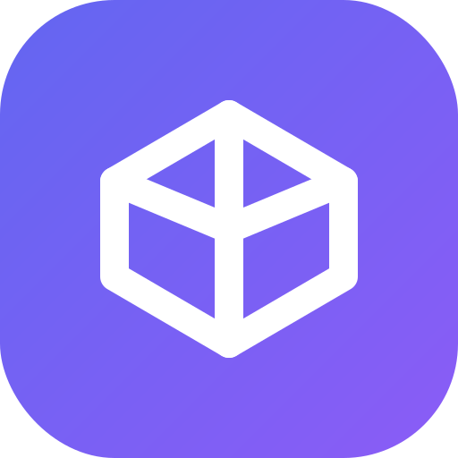
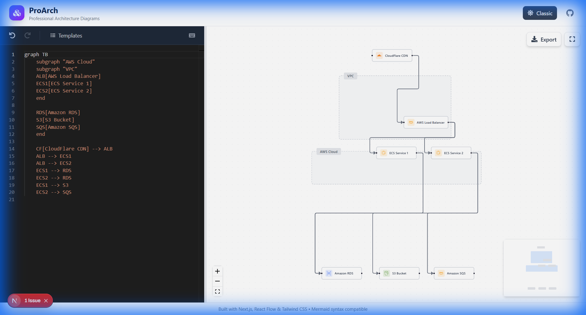
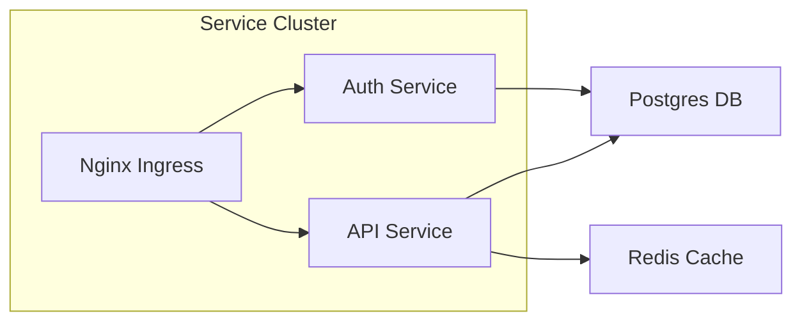

# ProArch

<div align="center">



**Transform Mermaid.js syntax into stunning, Cloudcraft-quality architecture diagrams**

[](https://opensource.org/licenses/MIT)
[](https://nextjs.org/)
[](https://reactflow.dev/)
[](https://www.typescriptlang.org/)
[](https://tailwindcss.com/)

[Live Demo](#live-demo) • [Features](#features) • [Quick Start](#quick-start) • [Documentation](#documentation) • [Contributing](#contributing)

</div>

---

## 🎯 The Problem

Standard Mermaid.js diagrams look academic and flat. When you need diagrams for **executive presentations**, **technical documentation**, or **client proposals**, you need something that looks professional.

**ProArch bridges the gap** — keep your "diagram-as-code" workflow while getting output that matches high-end tools like Cloudcraft or Lucidchart.

<div align="center">



</div>

---

## ✨ Features

### 🎨 Professional Aesthetics
- **Card-style nodes** with shadows, icons, and brand colors
- **100+ technology icons** auto-detected from labels (AWS, GCP, Redis, Postgres, Kafka...)
- **Subgraph clusters** with gradient backgrounds and dashed borders
- **Two themes**: Modern (shadows + gradients) and Classic (flat + minimal)

### ⚡ Powerful Editor
- **Monaco Editor** with syntax highlighting
- **Live preview** — changes render instantly
- **6 built-in templates** (Microservices, AWS, Kubernetes, CI/CD, GraphQL, Kafka)
- **Undo/Redo** with keyboard shortcuts (Ctrl+Z / Ctrl+Shift+Z)
- **Auto-save** to localStorage

### 📤 Export Options
- **High-res PNG** (2x scale)
- **Vector SVG** for infinite scaling
- **Copy to clipboard** for quick pasting

### 🧭 Canvas Controls
- **Zoom/Pan** with mouse or touch
- **Minimap** for large diagrams
- **Fullscreen mode** for presentations
- **Drag & drop** node repositioning

---

## 🚀 Quick Start

### Prerequisites

- Node.js 18+ 
- npm or yarn

### Installation

```bash
# Clone the repository
git clone https://github.com/yourusername/proarch.git
cd proarch

# Install dependencies
npm install

# Start development server
npm run dev
```

Open [http://localhost:3000](http://localhost:3000) in your browser.

### Build for Production

```bash
npm run build
npm start
```

---

## 📖 Documentation

### Supported Mermaid Syntax

ProArch supports the following Mermaid flowchart syntax:



| Syntax | Description |
|--------|-------------|
| `graph LR` / `graph TD` | Left-to-right or top-down layout |
| `A[Label]` | Rectangle node |
| `A(Label)` | Rounded node |
| `A{Label}` | Diamond node |
| `A --> B` | Arrow edge |
| `A --- B` | Line edge |
| `A -.-> B` | Dashed edge |
| `A ==> B` | Thick edge |
| `subgraph "Title" ... end` | Group nodes in cluster |

### Auto-Icon Detection

ProArch automatically detects technology names in node labels and displays the appropriate icon:

| Keyword | Icon |
|---------|------|
| `nginx`, `ingress` |  |
| `redis`, `cache` |  |
| `postgres`, `postgresql` |  |
| `kafka` |  |
| `docker`, `container` |  |
| `kubernetes`, `k8s` |  |
| `aws`, `amazon` |  |
| `gcp`, `google` |  |

[See full icon list →](docs/ICONS.md)

---

## 🏗️ Architecture

```
┌─────────────────────────────────────────────────────────────┐
│                         ProArch                              │
├─────────────────────────────────────────────────────────────┤
│  ┌──────────────┐    ┌──────────────┐    ┌──────────────┐  │
│  │    Monaco    │───▶│   Mermaid    │───▶│    Dagre     │  │
│  │    Editor    │    │    Parser    │    │    Layout    │  │
│  └──────────────┘    └──────────────┘    └──────────────┘  │
│         │                                       │           │
│         ▼                                       ▼           │
│  ┌──────────────┐                       ┌──────────────┐   │
│  │   Zustand    │◀──────────────────────│  React Flow  │   │
│  │    Store     │                       │    Canvas    │   │
│  └──────────────┘                       └──────────────┘   │
│                                                │            │
│                                                ▼            │
│                                         ┌──────────────┐   │
│                                         │   Export     │   │
│                                         │  PNG / SVG   │   │
│                                         └──────────────┘   │
└─────────────────────────────────────────────────────────────┘
```

### Tech Stack

| Layer | Technology |
|-------|------------|
| Framework | [Next.js 16](https://nextjs.org/) |
| UI | [React 19](https://react.dev/) |
| Styling | [Tailwind CSS 4](https://tailwindcss.com/) |
| Canvas | [React Flow 11](https://reactflow.dev/) |
| Editor | [Monaco Editor](https://microsoft.github.io/monaco-editor/) |
| State | [Zustand](https://zustand-demo.pmnd.rs/) |
| Layout | [Dagre](https://github.com/dagrejs/dagre) |
| Icons | [React Icons](https://react-icons.github.io/react-icons/) |
| Export | [html-to-image](https://github.com/bubkoo/html-to-image) |

### Project Structure

```
src/
├── app/                    # Next.js App Router
│   ├── layout.tsx          # Root layout
│   ├── page.tsx            # Main page
│   └── globals.css         # Global styles
├── components/
│   ├── canvas/             # React Flow canvas
│   ├── editor/             # Monaco editor
│   ├── nodes/              # Custom node components
│   └── ui/                 # UI components
├── lib/
│   ├── parser/             # Mermaid → nodes/edges
│   ├── layout/             # Dagre auto-layout
│   ├── icons/              # Icon mapping
│   ├── templates/          # Sample diagrams
│   └── export/             # PNG/SVG export
├── stores/                 # Zustand state
└── types/                  # TypeScript types
```

---

## 🤝 Contributing

We welcome contributions! Please see our [Contributing Guide](CONTRIBUTING.md) for details.

### Quick Contribution Steps

1. Fork the repository
2. Create a feature branch (`git checkout -b feature/amazing-feature`)
3. Commit your changes (`git commit -m 'Add amazing feature'`)
4. Push to the branch (`git push origin feature/amazing-feature`)
5. Open a Pull Request

### Development

```bash
# Run development server with hot reload
npm run dev

# Run linting
npm run lint

# Build for production
npm run build
```

---

## 📄 License

This project is licensed under the MIT License - see the [LICENSE](LICENSE) file for details.

---

## 🙏 Acknowledgments

- [React Flow](https://reactflow.dev/) for the amazing canvas library
- [Mermaid.js](https://mermaid.js.org/) for the diagram syntax inspiration
- [Simple Icons](https://simpleicons.org/) for brand icons
- [Cloudcraft](https://www.cloudcraft.co/) for visual inspiration

---

<div align="center">

**[⬆ Back to Top](#proarch)**

Made with ❤️ by the open source community

</div>
